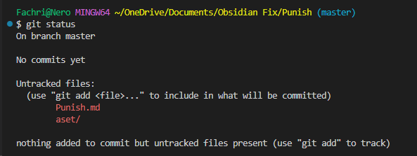

Untuk siswa yang ingin menyimpan catatan obsidiannya di github ada beberapa cara yang akan di lakukan untuk meng-upload catatan dari siswa tersebut. Berikut adalah langkah-langkah untuk meng-upload catatan dan juga meng-update catatan.

# Meng-upload Catatan
untuk mengupload catatan pastikan catatan obsidian telah di catat sepenuhnya lalu pastikan aset dan hal hal lainnya sudah ter-tata dengan baik. Untuk langkah-langkah nya akan seperti berikut.

## 1) Masuk & Buka Folder Pada VSCode

## 2) Pilih Folder Yang Ingin Anda Post

setelah masuk klik "ctrl" + "kutip atas".

## 3) Masuk ke "Git Bash"

kita akan menggunakan github untuk mengupload folder catatan kita.

## 4) Klik "`git init`"

git init ini berfungsi untuk masuk ke dalam file yang akan kita upload.

## 5) Klik "`git status`"

git status ini berfungsi untuk mengecek status file yang ada dalam folder kita.

## 6) Klik "`git add .`"

git add . berfungsi untuk memasukkan semua file yang akan di upload dalam folder tersebut.

## 7) Klik "`git commit -m "keterangan"`"

git commit ini untuk menyimpan keterangan upload maupun update yang dilakukan

## 8) Buat Repository

Buat repository untuk menyimpan catatan yang anda inginkan.

## 9) Ikuti Langkah-Langkah Dibawah

untuk langkah selanjutnya kita dapat mengcopy paste kode kode yang diberikan oleh github.

## 10) Klik "`git branch -m main`"

ikuti langkah langkah yang telah diberikan.

## 11) Klik "`git remote add origin ...`"

copy paste kode yang telah diberikan oleh github.

## 12) Push folder

push folder yang akan anda gunakan.

## 13) Folder Telah Ter-Upload

# Mang-Update Catatan
Ketika ada tambahan atau kesalahan pada catatan, dengan memperbaikinya di obsidian tidak cukup untuk mengubahnya di github. Berikut adalah cara untuk meng-update catatan yang kita buat.

## 1) Klik "`git status`"

Klik git status untuk mengecek file apa saja yang telah berubah.

## 2) Klik "`git add .`"

klik git add . untuk menambahkan catatan yang telah di ubah sebelumnya

## 3) Klik "`git status`" (opsional)

Klik git status untuk memastikan semua file telah masuk.

## 4) Klik "`git commit -m "catatan"`"

klik git commit -m untuk memasukkan riwayat update-an yang telah dibuat.

## 5) Push folder

Jika folder yang ingin di push gagal, maka harus di pull terlebih dahulu

## 6) Pull Folder

Setelah melakukan proses ini maka folder siap untuk di push kembali.

## 7) Push Kembali Folder

Setelah push folder, catatan akan masuk ke dalam github dengan sempurna, dan seluruh rangkain peng-upload an telah selesai.
