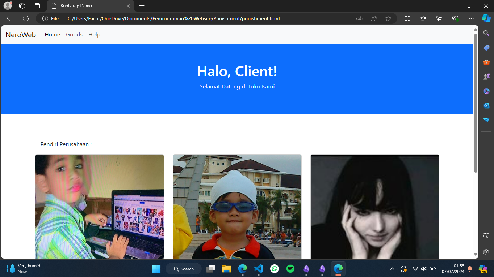

# Boostrap
boostrap adalah framework dimana kita bisa menyelesaikan tampilan web dengan lebih simpel dengan cara menuliskan cssnya di baris yang sama namun jadi lebih singkat, berikut adalah contoh peng-implementasinya.


**Kode Program :**
```html
<!DOCTYPE html>
<html lang="en">
<head>
    <meta charset="utf-8">
    <meta name="viewport" content="width=device-width, initial-scale=1">
    <title>Bootstrap Demo</title>
    <link href="https://cdn.jsdelivr.net/npm/bootstrap@5.3.3/dist/css/bootstrap.min.css" rel="stylesheet" integrity="sha384-QWTKZyjpPEjISv5WaRU9OFeRpok6YctnYmDr5pNlyT2bRjXh0JMhjY6hW+ALEwIH" crossorigin="anonymous">
</head>
<body>
    <!-- Navbar -->
    <nav class="navbar navbar-expand-lg navbar-light bg-light">
        <div class="container-fluid">
            <a class="navbar-brand" href="#">NeroWeb</a>
            <button class="navbar-toggler" type="button" data-bs-toggle="collapse" data-bs-target="#navbarNav" aria-controls="navbarNav" aria-expanded="false" aria-label="Toggle navigation">
                <span class="navbar-toggler-icon"></span>
            </button>
            <div class="collapse navbar-collapse" id="navbarNav">
                <ul class="navbar-nav">
                    <li class="nav-item">
                        <a class="nav-link active" aria-current="page" href="#">Home</a>
                    </li>
                    <li class="nav-item">
                        <a class="nav-link" href="#">Goods</a>
                    </li>
                    <li class="nav-item">
                        <a class="nav-link" href="#">Help</a>
                    </li>
                </ul>
            </div>
        </div>
    </nav>
    <!-- Header -->
    <header class="bg-primary text-white text-center py-5">
        <div class="container">
            <h1>Halo, Client!</h1>
            <p>Selamat Datang di Toko Kami</p>
        </div>
    </header>
    <!-- Main content -->
    <div class="container my-5">
        <br>
    <p style="margin-left: 15px;">Pendiri Perusahaan :</p>
        <div class="row">
            <!-- Card 1 -->
            <div class="col-lg-4 mb-4">
                <div class="card">
                    
                    <div class="card-body">
                        <h5 class="card-title">Fachri</h5>
                        <p class="card-text">Fachri, Beliau adalah pendiri pertama dari perusahaan Nero.</p>
                        <a href="#" class="btn btn-primary">Go somewhere</a>
                    </div>
                </div>
            </div>
            <!-- Card 2 -->
            <div class="col-lg-4 mb-4">
                <div class="card">
                    
                    <div class="card-body">
                        <h5 class="card-title">Acli</h5>
                        <p class="card-text">Acli, Beliau adalah pendiri pertama dari perusahaan Nero.</p>
                        <a href="#" class="btn btn-primary">Go somewhere</a>
                    </div>
                </div>
            </div>
            <!-- Card 3 -->
            <div class="col-lg-4 mb-4">
                <div class="card">
                    
                    <div class="card-body">
                        <h5 class="card-title">Monya</h5>
                        <p class="card-text">Monya, Beliau adalah pendiri pertama dari perusahaan Nero.</p>
                        <a href="#" class="btn btn-primary">Go somewhere</a>
                    </div>
                </div>
            </div>
        </div>
    </div>
    <!-- Footer -->
    <footer class="bg-light text-center py-3">
        <div class="container">
            <p class="mb-0">© 2024 Company, Inc.</p>
        </div>
    </footer>
    <script src="https://cdn.jsdelivr.net/npm/bootstrap@5.3.3/dist/js/bootstrap.bundle.min.js" integrity="sha384-YvpcrYf0tY3lHB60NNkmXc5s9fDVZLESaAA55NDzOxhy9GkcIdslK1eN7N6jIeHz" crossorigin="anonymous"></script>
</body>
</html>
```
**Hasil :**


**Analisis :**
1. `DOCTYPE html`: Mendeklarasikan tipe dokumen HTML.
2. `<html lang="en">`: Menetapkan bahasa utama dokumen sebagai bahasa Inggris.
3. `<head>`: Bagian ini berisi metadata dokumen dan link ke sumber daya eksternal
4. `<meta charset="utf-8">`: Menetapkan karakter encoding dokumen ke UTF-8.
5. `<meta name="viewport" content="width=device-width, initial-scale=1">`: Menetapkan viewport agar responsif terhadap ukuran layar perangkat.
6. `<title>Bootstrap Demo</title>`: Menetapkan judul dokumen.
`<link href="https://cdn.jsdelivr.net/npm/bootstrap@5.3.3/dist/css/bootstrap.min.css" rel="stylesheet" integrity="sha384-QWTKZyjpPEjISv5WaRU9OFeRpok6YctnYmDr5pNlyT2bRjXh0JMhjY6hW+ALEwIH" crossorigin="anonymous">`: Menyertakan CSS Bootstrap dari CDN dengan integritas dan pengaturan cross-origin.
7. `<nav class="navbar navbar-expand-lg navbar-light bg-light">`: Membuat navbar dengan kelas Bootstrap untuk tampilan responsif dan latar belakang berwarna terang.
8. `<div class="container-fluid">`: Membuat kontainer yang fleksibel dan penuh untuk mengatur isi navbar.
9. `<a class="navbar-brand" href="#">NeroWeb</a>`: Menetapkan logo atau nama brand pada navbar.
10. `<button class="navbar-toggler" type="button" data-bs-toggle="collapse" data-bs-target="#navbarNav" aria-controls="navbarNav" aria-expanded="false" aria-label="Toggle navigation">`: Tombol untuk toggling navbar pada perangkat kecil.
11. `<span class="navbar-toggler-icon"></span>`: Ikon toggle default dari Bootstrap.
12. `<div class="collapse navbar-collapse" id="navbarNav">`: Kontainer untuk item navbar yang akan berkolaps pada perangkat kecil.
13. `<ul class="navbar-nav">`: Daftar item navbar.
14. `<li class="nav-item">`: Setiap item navbar.
15. `<a class="nav-link active" aria-current="page" href="#">Home</a>`: Link aktif untuk halaman Home.
16. `<a class="nav-link" href="#">Goods</a>`: Link untuk halaman Goods.
17. `<a class="nav-link" href="#">Help</a>`: Link untuk halaman Help.
18. `<header class="bg-primary text-white text-center py-5">`: Bagian header dengan latar belakang berwarna biru, teks berwarna putih, teks tengah, dan padding vertikal.
19. `<div class="container">`: Membuat kontainer untuk isi header.
20. `<h1>Halo, Client!</h1>`: Judul utama dalam header.
21. `<p>Selamat Datang di Toko Kami</p>`: Paragraf teks dalam header.
22. `<div class="container my-5">`: Membuat kontainer dengan margin vertikal untuk isi utama halaman.
22. `<br>`: Menambahkan jeda baris.
23. `<p style="margin-left: 15px;">Pendiri Perusahaan :</p>`: Paragraf dengan teks yang memiliki margin kiri.
24. `<div class="row">`: Membuat baris untuk mengatur tata letak kartu.
25. `<div class="col-lg-4 mb-4">`: Membuat kolom berukuran besar-4 dengan margin bawah.
26. `<div class="card">`: Membuat kartu Bootstrap.
27. ``: Menampilkan gambar di atas kartu.
28. `<div class="card-body">`: Kontainer untuk isi kartu.
29. `<h5 class="card-title">Fachri</h5>`: Judul kartu.
30. `<p class="card-text">Fachri, Beliau adalah pendiri pertama dari perusahaan Nero.</p>`: Teks kartu.
30. `<a href="#" class="btn btn-primary">Go somewhere</a>`: Tombol dengan gaya tombol primer Bootstrap.
(Card 2 dan Card 3 memiliki struktur yang sama dengan Card 1)
31. `<footer class="bg-light text-center py-3">`: Bagian footer dengan latar belakang berwarna terang, teks tengah, dan padding vertikal.
32. `<div class="container">`: Membuat kontainer untuk isi footer.
33. `<p class="mb-0">© 2024 Company, Inc.</p>`: Paragraf tanpa margin bawah.
`<script src="https://cdn.jsdelivr.net/npm/bootstrap@5.3.3/dist/js/bootstrap.bundle.min.js" integrity="sha384-YvpcrYf0tY3lHB60NNkmXc5s9fDVZLESaAA55NDzOxhy9GkcIdslK1eN7N6jIeHz" crossorigin="anonymous"></script>`: Menyertakan JavaScript Bootstrap dari CDN dengan integritas dan pengaturan cross-origin.

**Kesimpulan :**
Boostrap dapat memudahkan programmer untuk membuat tampilan web sederhana maupun ke atas namun tetap saja boostrap ini tetap memiliki kekurangan dan kelebihan yang dapat di pertimbangkan.
