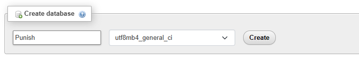
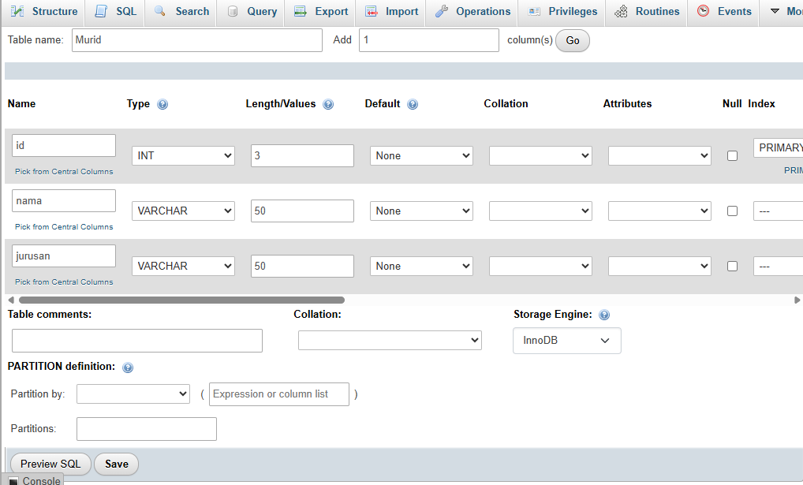
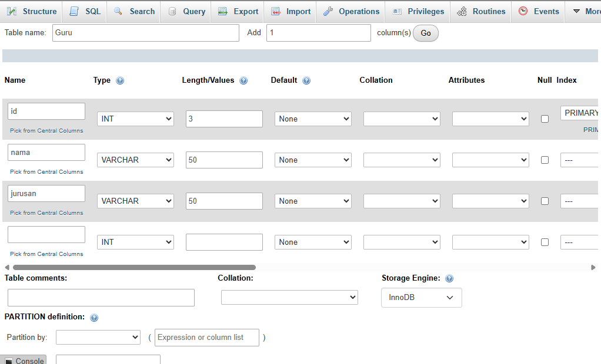
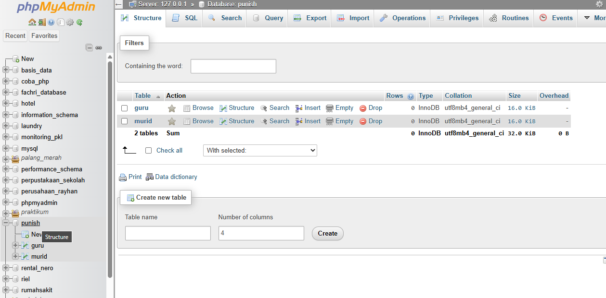
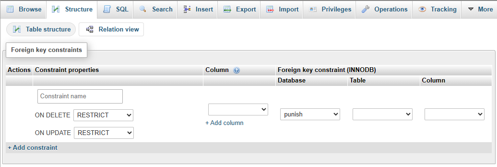
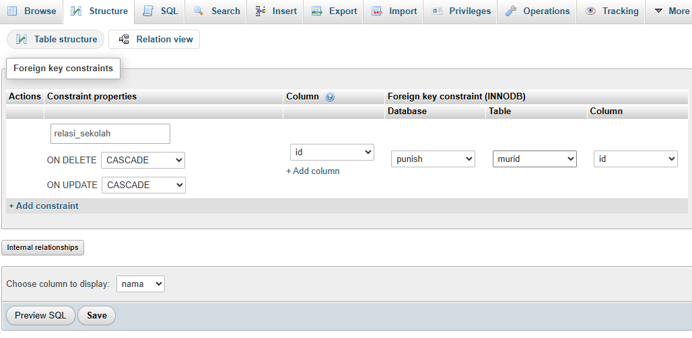
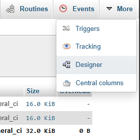
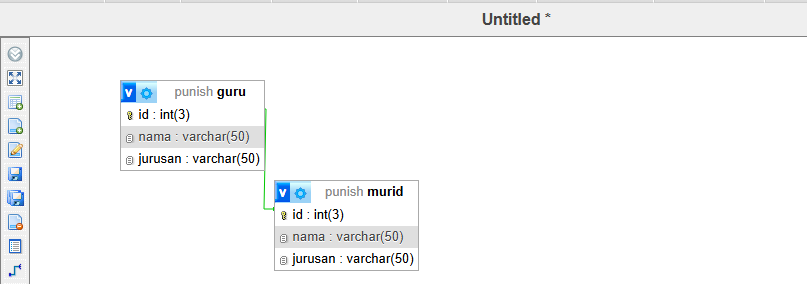

# Relasi Table
untuk relasi table pada phpmyadmins langkah langkahnya cukup mudah dan berikut ialah langkah langkah relasi table pada phpmyadmins.

## 1) Buat Database

Buat databse untuk table yang ingin di relasikan.

## 2) Membuat Table Pertama

buatlah table pertama.

## 3) Membuat Table Kedua

buatlah table kedua.

## 4) Kembali Ke Database

kembali ke tampilan database.

## 5) Masuk ke Salah Satu Table

masuk ke salah satu table yang ingin di relasikan.

## 6) Masuk ke "Structure" lalu ke "Relation View"

gunakan lah format di atas dan pilih column yang ingin di relasikan seusai keinginan.

## 7) Klik "More" lalu ke "Designer"

masuk ke salah satu table lalu pilih "more" dan "Designer".

## 8) Table telah di relasikan

Table telah berhasil di relasikan.