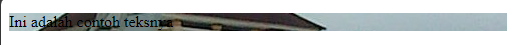
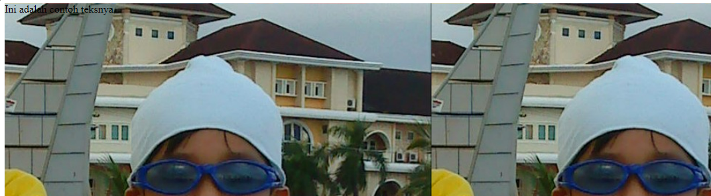
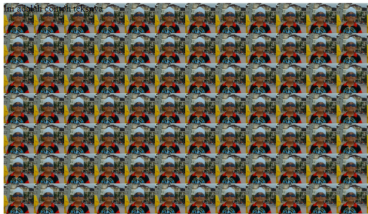
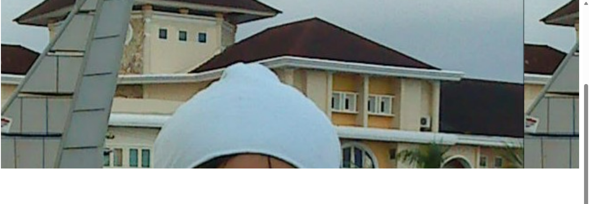
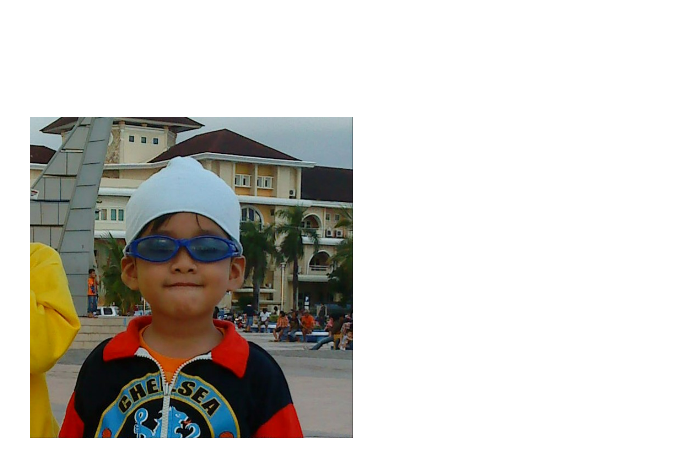

## Materi Background
Untuk  property background kita akan mempelajari beberapa value dan untuk lebih jelasnya kita akan mempelarinya di bawah ini.

#### Background-Image
untuk background image ini kita akan dapat menampilkan background dengan image sesuai dengan yang ingin kita pilih/dari file kita, untuk contoh programnya akan seperti berikut.
**Contoh Program :**
```css
.background-image {
    background-image:url(./aset/backgroundd.JPG)
}
```
**Hasil Program :**


#### Background-Size
lalu untuk background size kita mengatur size/ukuran dari background yang kita gunakan dan valuenya dapat kita atur sesuai dengan keinginan kita. untuk contoh penggunananya akan seperti berikut ini.
**Contoh Program :**
```css
.background {
    background-image:url(./aset/backgroundd.JPG);
    width: 100%;
    height: 100VH;
    
    background-size: 50%;
}
```
**Hasil Program :**


#### Background-Repeat
untuk background-repeat ini mengulang gambar dalam ukurannya dan untuk penggunaannya akan seperti dibawah ini.
**Contoh Program :**
```css
.background {
    background-image:url(./aset/backgroundd.JPG);
    width: 100%;
    height: 100VH;
    background-size: 50px;
    
    background-repeat: repeat;
}
```
**Hasil Program :**



#### Background-Attachment
background-attachment ini mengatur ketetapan image yang di gunakan contohnya ialah seperti penggunaan value "fixed" yang membuat gambar tetap berada di posisinya walau di scroll, untuk contoh penggunaanya akan seperti berikut.
**Contoh Program :**
```css
.background {
    background-image:url(./aset/backgroundd.JPG);
    width: 100%;
    height: 50px;
    background-size: 90%;
    
    background-attachment: fixed;
}
```
**Hasil Program :**



#### Background-Postion
dan yang terakhir ialah background-postion dan fungsinya ialah untuk mengatur posisi dari background yang digunakan, untuk contoh penggunaanya aka seperti dibawah ini.
**Contoh Program :**
```css
.background {
    background-image:url(./aset/backgroundd.JPG);
    width: 100vh;
    height: 100vh;
    background-size: 50%;
    background-repeat: no-repeat;
    
    background-position:10% ,50% ;
}
```
**Hasil Program :**

