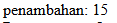
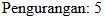

# Aritmatika dan Perbandingan
Untuk materi PHP kita akan mempelajari materi operator "Aritmatika" dan "Perbandingan" dan untuk penjelasan lebih lanjutnya akan di bahas di bawah ini.

## Operator
Dalam php juga kita dapat menggunakan operator operator untuk memudahkan penulisan program kita, Untuk penjelasan lebih jelasnya akan di dijelaskan di bawah.
### Aritmatika
Operator aritmatika berfungsi untuk penjumlah, pengurangan, perkalian dan pembagian. Untuk penggunaan akan seperti di bawah ini.
1. **Penjumlahan**
```php
    $a = 10;
    $b = 5;
    //Penambahan
    $penambahan = $a + $b;
    echo "penambahan: " . $Penambahan . "<br>";
```
**Hasil :**


> [! info]- Analisis penjumlahan
>> `$a = 10;` : berfungsi sebagai variable yang memiliki nilai "10"
>> `$b = 5;` : berfungsi sebagai variable yang memiliki nilai "5"
>> `$penambahan = $a + $b;` : `$penambahan` berfungsi menyimpan variable dari hasil dari variable `$a` dan `$b`.
>> `echo "penambahan: " .$penambahan . "<br>;"` berfungsi untuk menampilkan hasil dari penambahan variable `$a` dan `$b`.

**Kesimpulan :**
operator `+` berfungsi untuk menjumlahkan isi dari variable yang kita ketikkan, dan hasilnya dapat kita tampilkan menggunakan echo.


2. **Pengurangan**
```php
	//pengurangan
    $Pengurangan = $a - $b;
    echo "Pengurangan: " . $Pengurangan . "<br>";
```
**Hasil :**


> [! info]- Analisis pengurangan
>> `$a = 10;` : berfungsi sebagai variable yang memiliki nilai "10"
>> `$b = 5;` : berfungsi sebagai variable yang memiliki nilai "5"
>> `$penambahan = $a - $b;` : `$pengurangan` berfungsi menyimpan variable dari hasil dari variable `$a` dan `$b`.
>> `echo "pengurangan: " .$pengurangan . "<br>;"` berfungsi untuk menampilkan hasil dari pengurangan variable `$a` dan `$b`.

**Kesimpulan :**
operator `-` berfungsi untuk menguragi isi dari variable yang kita ketikkan, dan hasilnya dapat kita tampilkan menggunakan echo.

3. **Perkalian**
```php
	//perkalian
    $Perkalian = $a * $b;
    echo "Perkalian: " . $Perkalian . "<br>";
```
**Hasil :**


> [! info]- Analisis perkalian
>> `$a = 10;` : berfungsi sebagai variable yang memiliki nilai "10"
>> `$b = 5;` : berfungsi sebagai variable yang memiliki nilai "5"
>> `$perkalian = $a + $b;` : `$perkalian` berfungsi menyimpan variable dari hasil dari variable `$a` dan `$b`.
>> `echo "perkalian: " .$perkalian . "<br>;"` berfungsi untuk menampilkan hasil dari perkalian variable `$a` dan `$b`.

**Kesimpulan :**
operator `*` berfungsi untuk mengkali isi dari variable yang kita ketikkan, dan hasilnya dapat kita tampilkan menggunakan echo.

4. Pembagian
```php
	//pembagian
    $pembagian = $a / $b;
    echo "pembagian: " . $pembagian . "<br>";
```
**Hasil :**


> [! info]- Analisis pembagian
>> `$a = 10;` : berfungsi sebagai variable yang memiliki nilai "10"
>> `$b = 5;` : berfungsi sebagai variable yang memiliki nilai "5"
>> `$pembagian = $a + $b;` : `$pembagian` berfungsi menyimpan variable dari hasil dari variable `$a` dan `$b`.
>> `echo "pembagian: " .$pembagian . "<br>;"` berfungsi untuk menampilkan hasil dari pembagian variable `$a` dan `$b`.

**Kesimpulan :**
operator `/` berfungsi untuk membagi isi dari variable yang kita ketikkan, dan hasilnya dapat kita tampilkan menggunakan echo.


### Perbandingan
Operator perbandingan atau operator perbandingan digunakan untuk membandingkan 2 operan atau lebih. Pada umumnya Operator perbandingan digunakan pada kondisi if-else sebagai penentu tingkat kesesuaian.

1. **Perbandingan** ==
```php
$a = 5;
$b = 10;
// Operator perbandingan ==
if ($a == $b) {
    echo "Nilai a sama dengan nilai b";
} else {
    echo "Nilai a tidak sama dengan nilai b";
}
```
**Hasil :**


> [! info]- Analisis pembagian ==
>> `$a = 5;` : berfungsi sebagai variable yang memiliki nilai "5"
>> `$b = 10;` : berfungsi sebagai variable yang memiliki nilai "10"
>> `if ($a == $b) { echo "Nilai a sama dengan nilai b";` : jika nilai `$a` dan nilai `$b` sama makan akan menampilkan "Nilai a sama dengan nilai b"
>> `} else { echo "Nilai a tidak sama dengan nilai b";}` : Namun jika nilai `$a` dan nilai `$b` tidak sama maka akan menampilkan hasil "Nilai a tidak sama dengan nilai b"

**Kesimpulan :**
jadi pada perbandingan `==` ialah untuk membandingkan apakah nilai dari variable `$a` dan variable `$a` bernilai sama atau kah tidak.

2. **Perbandingan** !=
```php
// Operator perbandingan !=
if ($a != $b) {
    echo "Nilai a tidak sama dengan nilai b";
} else {
    echo "Nilai a sama dengan nilai b";
}
```
**Hasil :**


> [! info]- Analisis pembagian !=
>> `$a = 5;` : berfungsi sebagai variable yang memiliki nilai "5"
>> `$b = 10;` : berfungsi sebagai variable yang memiliki nilai "10"
>> `if ($a != $b) { echo "Nilai a tidak sama dengan nilai b";` : jika nilai `$a` dan nilai `$b` tidal sama makan akan menampilkan "Nilai a tidak sama dengan nilai b"
>> `} else { echo "Nilai a sama dengan nilai b";}` : Namun jika nilai `$a` dan nilai `$b` sama maka akan menampilkan hasil "Nilai a sama dengan nilai b"

**Kesimpulan :**
Jadi pada perbandingan != ialah untuk membandingkan variable `$a` dan variable `$a` apakah tidak sama dengan atau tidak.

3. Perbandingan > dan <
```php
if ($a > $b) {
    echo "Nilai a lebih besar dari nilai b";
} else {
    echo "Nilai a tidak lebih besar dari nilai b";
}
```
**Hasil :**


> [! info]- Analisis pembagian < dan >
>> `$a = 5;` : berfungsi sebagai variable yang memiliki nilai "5"
>> `$b = 10;` : berfungsi sebagai variable yang memiliki nilai "10"
>> `if ($a > $b) { echo "Nilai a lebih besar dari nilai b";` : jika nilai `$a` dan nilai `$b` tidal sama makan akan menampilkan "Nilai a lebih besar dari nilai b"
>> `} else { echo "Nilai a tidak lebih besar dari nilai b";}` : Namun jika nilai `$a` dan nilai `$b` sama maka akan menampilkan hasil "Nilai a tidak lebih besar dari nilai b"
>> **Namun jika tandanya berubah `<` maka hasilnya akan sebaliknya**

**Kesimpulan :**
jadi pada perbandingan `>` atau `<` adalah untuk membandingkan nilai dari kedua vaiable dimana salah satunya lebih besar dari atau lebih kecil dari.

4. **Perbandingan** >= dan =<
```php
if ($a >= $b) {
    echo "Nilai a lebih besar dari atau sama dengan nilai b";
} else {
    echo "Nilai a tidak lebih besar dari atau sama dengan nilai b";
}
```
**Hasil :**


> [! info]- Analisis pembagian >= dan =<
>> `$a = 5;` : berfungsi sebagai variable yang memiliki nilai "5"
>> `$b = 10;` : berfungsi sebagai variable yang memiliki nilai "10"
>> `if ($a >= $b) { echo "Nilai a lebih besar dari atau sama dengan nilai b";` : jika nilai `$a` dan nilai `$b` tidal sama makan akan menampilkan "Nilai a lebih besar dari atau sama dengan nilai b"
>> `} else { echo "Nilai a tidak lebih besar dari atau sama dengan nilai b` : Namun jika nilai `$a` dan nilai `$b` sama maka akan menampilkan hasil "Nilai a tidak lebih besar dari atau sama dengan nilai b"
>> **Namun jika tandanya berubah `<=` maka hasilnya akan sebaliknya

**Kesimpulan :**
jadi pada perbandingan `>=` atau `=<` adalah untuk membandingkan nilai dari kedua variable dimana salah satunya lebih besar atau sama dengan atau lebih kecil atau sama dengan.
